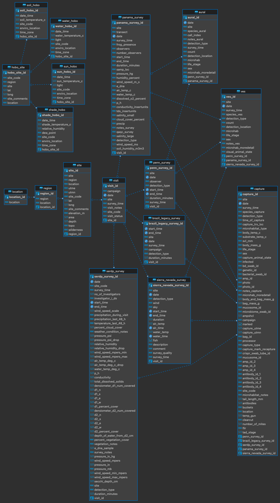

```{r setup, include=FALSE}
if (!require(librarian)){
  install.packages("librarian")
  library(librarian)
}
# librarian downloads, if not already downloaded, and reads in needed packages
librarian::shelf(here, tidyverse, googledrive)

knitr::opts_chunk$set(echo = TRUE, fig.align="center")
```

## Data Acquisition Protocol

-   Select variables of interest from data tables
-   Contact data owners within RIBBiTR for approved use of data; CC data manager
    -   Per [RIBBiTR data sharing agreement](https://docs.google.com/document/d/1m1EEuUH3ioVVXtFkDaWFHITddPcmputEhZxfW_omtrI/edit#heading=h.q4aj1repk7gi)
-   Contact data manager to develop query for variables of interest

<center>{width="275px"} {width="200px"}</center>

<center></center>

```{r, echo = F, message=F}

schema_folder <- "https://drive.google.com/drive/folders/1KBkHAjwyaCufJpM1qbcyN6F-pd_uJpxU"

id <- drive_get(as_id(schema_folder))

drive_upload(media = here("ribbitr_schema.pdf"), path = as_id(id), overwrite = T)

```
