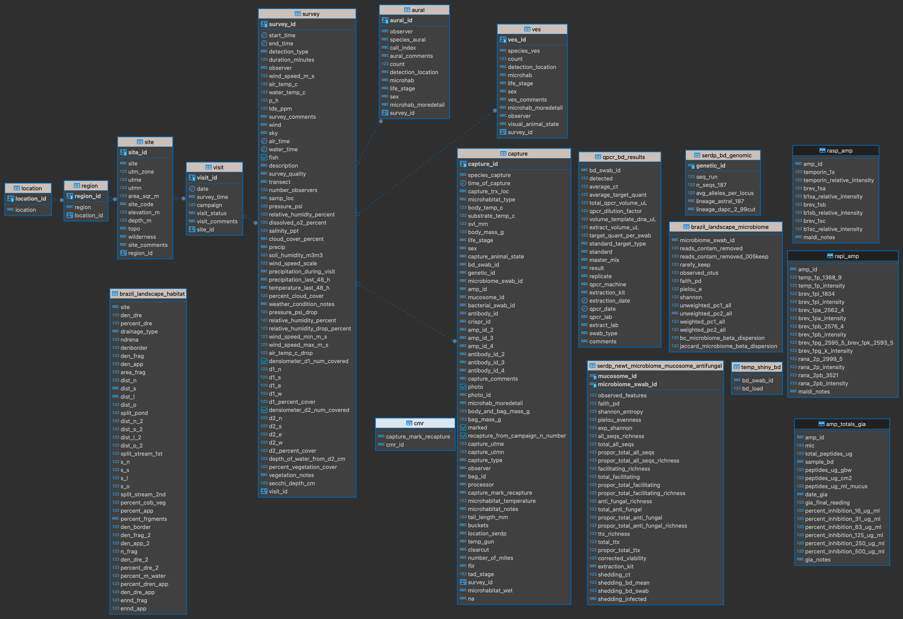

```{r setup, include=FALSE}
if (!require(librarian)){
  install.packages("librarian")
  library(librarian)
}
# librarian downloads, if not already downloaded, and reads in needed packages
librarian::shelf(here, tidyverse, googledrive)

knitr::opts_chunk$set(echo = TRUE, fig.align="center")
```

## Data Acquisition Protocol

-   Select variables of interest from the data tables within schemas
-   Contact data owners within RIBBiTR for approved use of data; CC data manager
    -   Per [RIBBiTR data sharing agreement](https://docs.google.com/document/d/1m1EEuUH3ioVVXtFkDaWFHITddPcmputEhZxfW_omtrI/edit#heading=h.q4aj1repk7gi)
    - Data owners
      - Panama Survey Data: [Jamie Voyles](jvoyles@unr.edu)
      - SERDP Survey Data: [Cori Richards-Zawacki](cori.zawacki@pitt.edu)
      - Pennsylvania Survey Data: [Cori Richards-Zawacki](cori.zawacki@pitt.edu)
      - Sierra Nevada Survey Data: [Roland Knapp](roland.knapp@ucsb.edu)
      - Brazil Legacy Survey Data: [Gui Becker](guibecker@psu.edu)
      - AMP: [Louise Rollins-Smith](louise.rollins-smith@vanderbilt.edu)
      - Microbiome: [Doug Woodhams](dwoodhams@gmail.com)
      - Genetic: [Bree Rosenblum](rosenblum@berkeley.edu)
      - Antibody: [Louise Rollins-Smith](louise.rollins-smith@vanderbilt.edu)
      - Bacterial: [Doug Woodhams](dwoodhams@gmail.com)
      - Mucosome: [Doug Woodhams](dwoodhams@gmail.com)
-   Contact data manager to develop query for variables of interest
-   *Note*: If you are requesting data from a processed swab table, then you must also contact the team that collected the swab and the team that processed the swab.

<center>{width="175px"} {width="100px"}</center>

\pagebreak

# Schema: "survey_data"

  The data found within the "survey_data" schema is comprised of RIBBiTR researcher legacy data and new NSF funded RIBBiTR data from Brazil, Panama, Sierra Nevada's (CA), Pennsylvania, Tennessee, Vermont, New Mexico, and Louisiana. Data for select sites in The Sierra Nevada's begins in 1995 with the majority of the data ranging between 2012-present. The most course resolution of data begins in the "location" table; Panama, Brazil, or USA, with the finest resolution of data to the individual level in the "capture" table. Each RIBBiTR site, Pennsylvania, Panama, Brazil, and Sierra Nevada's, has their own unique survey table (IE "penn_survey") to distinguish between region specific metadata. Within the "capture" table, there is individual level characteristics as well as columns indicating the various swabs and samples collected from the organism (IE "bd_swab_id"). Tables displayed to the right of the "capture" table contain processed swab data for various swabs and samples (IE "sierra_nevada_bd").     

## Swab Data Nomenclature

- bd_swab_id: dry swab used for Bd detection
- genetic_id: sample used for genetic processing (buccal, toe clip, tissue)
- bacterial_swab_id: swab used for culturing bacteria 
- mucosome_id: sample used for identifying all micro organisms 
- microbiome_swab_id: swab used for sequencing bacteria
- crispr_swab_id: swab used for crispr Bd detection
- amp_id: sample used for anti-microbial peptide processing
- antibody_id: 

### "survey_data"
<center></center>

## Schema: "hobo"
<center></center>

## Schema: "antifungal_isolate"
<center></center>

```{r, echo = F, message=F}

schema_folder <- "https://drive.google.com/drive/folders/1KBkHAjwyaCufJpM1qbcyN6F-pd_uJpxU"

id <- drive_get(as_id(schema_folder))

drive_upload(media = here("ribbitr_schema.pdf"), path = as_id(id), overwrite = T)

```
